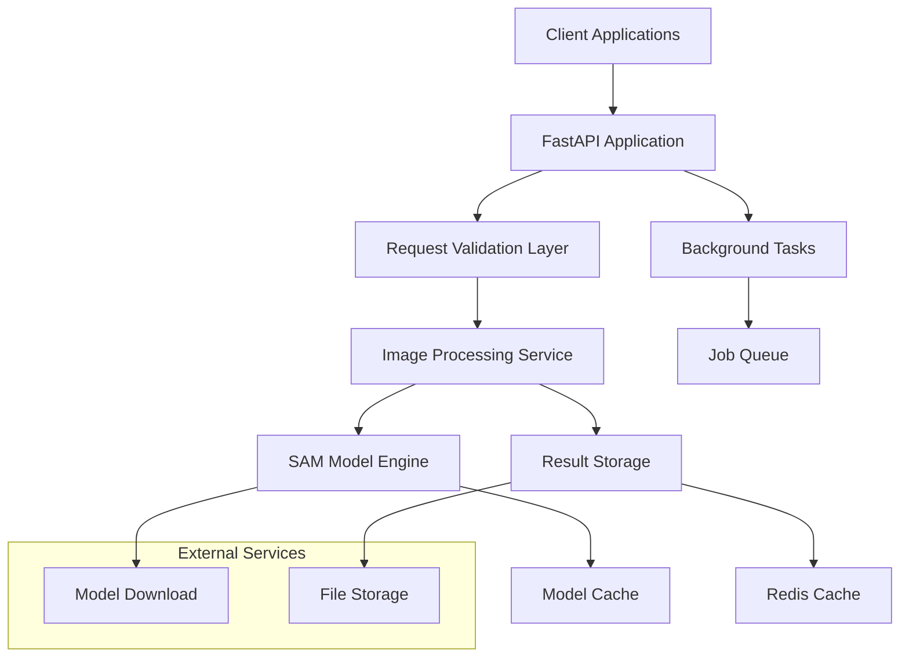
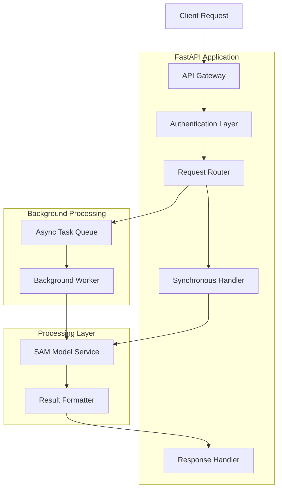
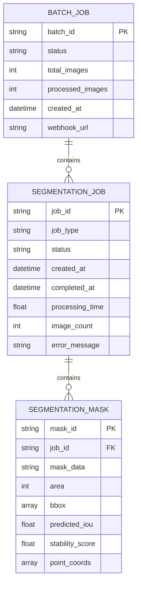

## 1. Architecture Design



## 2. Technology Description

* **Backend**: FastAPI\@latest with async support and automatic OpenAPI documentation

* **Model Engine**: PyTorch with Segment Anything Model (SAM) for image segmentation

* **Task Queue**: Celery with Redis for background job processing

* **Cache**: Redis for result caching and session management

* **File Storage**: Local filesystem with configurable cloud storage support

* **Model Storage**: Persistent volume mounting for model files

* **Initialization Tool**: UV for fast Python package management

* **Container**: Docker with multi-stage builds for optimization

## 3. Route Definitions

| Route                       | Purpose                                    |
| --------------------------- | ------------------------------------------ |
| GET /health                 | Service health check and model status      |
| GET /models                 | List available models and their status     |
| POST /segment               | Single image segmentation                  |
| POST /segment/batch         | Batch image segmentation                   |
| GET /jobs/{job\_id}/status  | Check batch job status                     |
| GET /jobs/{job\_id}/results | Retrieve batch job results                 |
| DELETE /jobs/{job\_id}      | Cancel batch job                           |
| GET /docs                   | Interactive API documentation (Swagger UI) |
| GET /redoc                  | Alternative API documentation (ReDoc)      |

## 4. API Definitions

### 4.1 Core API Endpoints

#### Single Image Segmentation

```
POST /api/v1/segment
```

Request:

| Param Name               | Param Type | isRequired | Description                                |
| ------------------------ | ---------- | ---------- | ------------------------------------------ |
| image                    | file       | true       | Image file (JPEG, PNG, WEBP, max 10MB)     |
| model\_type              | string     | false      | SAM model variant (vit\_h, vit\_l, vit\_b) |
| points\_per\_side        | integer    | false      | Grid points per side (default: 64)         |
| pred\_iou\_thresh        | float      | false      | IoU threshold (default: 0.90)              |
| stability\_score\_thresh | float      | false      | Stability threshold (default: 0.92)        |
| return\_visualization    | boolean    | false      | Include mask overlay visualization         |

Response:

| Param Name       | Param Type | Description                                       |
| ---------------- | ---------- | ------------------------------------------------- |
| job\_id          | string     | Unique identifier for this segmentation           |
| masks            | array      | Array of mask objects with metadata               |
| visualization    | string     | Base64 encoded visualization image (if requested) |
| processing\_time | float      | Time taken to process in seconds                  |

Example Response:

```json
{
  "job_id": "seg_123456",
  "masks": [
    {
      "segmentation": "base64_encoded_mask",
      "area": 15420,
      "bbox": [100, 150, 200, 300],
      "predicted_iou": 0.95,
      "stability_score": 0.93
    }
  ],
  "visualization": "base64_encoded_image",
  "processing_time": 2.34
}
```

#### Batch Segmentation

```
POST /api/v1/segment/batch
```

Request:

| Param Name   | Param Type | isRequired | Description                          |
| ------------ | ---------- | ---------- | ------------------------------------ |
| images       | array      | true       | Array of image files (max 50 images) |
| webhook\_url | string     | false      | URL for completion notification      |
| priority     | string     | false      | Job priority (low, normal, high)     |

Response:

| Param Name      | Param Type | Description                                        |
| --------------- | ---------- | -------------------------------------------------- |
| job\_id         | string     | Unique batch job identifier                        |
| status          | string     | Job status (queued, processing, completed, failed) |
| total\_images   | integer    | Number of images in batch                          |
| estimated\_time | integer    | Estimated processing time in seconds               |

## 5. Server Architecture Diagram



## 6. Data Model

### 6.1 Data Model Definition



### 6.2 Data Definition Language

#### Segmentation Jobs Table

```sql
-- create table
CREATE TABLE segmentation_jobs (
    job_id UUID PRIMARY KEY DEFAULT gen_random_uuid(),
    job_type VARCHAR(20) NOT NULL CHECK (job_type IN ('single', 'batch')),
    status VARCHAR(20) NOT NULL DEFAULT 'pending' CHECK (status IN ('pending', 'processing', 'completed', 'failed', 'cancelled')),
    created_at TIMESTAMP WITH TIME ZONE DEFAULT NOW(),
    completed_at TIMESTAMP WITH TIME ZONE,
    processing_time FLOAT,
    image_count INTEGER DEFAULT 1,
    error_message TEXT,
    model_type VARCHAR(10) DEFAULT 'vit_h',
    parameters JSONB
);

-- create indexes
CREATE INDEX idx_segmentation_jobs_status ON segmentation_jobs(status);
CREATE INDEX idx_segmentation_jobs_created_at ON segmentation_jobs(created_at DESC);
CREATE INDEX idx_segmentation_jobs_type ON segmentation_jobs(job_type);
```

#### Segmentation Masks Table

```sql
-- create table
CREATE TABLE segmentation_masks (
    mask_id UUID PRIMARY KEY DEFAULT gen_random_uuid(),
    job_id UUID NOT NULL REFERENCES segmentation_jobs(job_id) ON DELETE CASCADE,
    mask_data TEXT NOT NULL, -- Base64 encoded mask
    area INTEGER NOT NULL,
    bbox INTEGER[] NOT NULL, -- [x, y, width, height]
    predicted_iou FLOAT NOT NULL,
    stability_score FLOAT NOT NULL,
    point_coords FLOAT[][], -- Array of [x, y] coordinates
    created_at TIMESTAMP WITH TIME ZONE DEFAULT NOW()
);

-- create indexes
CREATE INDEX idx_segmentation_masks_job_id ON segmentation_masks(job_id);
CREATE INDEX idx_segmentation_masks_area ON segmentation_masks(area);
```

## 7. Model Management

### Model Download and Caching Strategy

```python
# Model configuration
MODEL_CONFIG = {
    "vit_h": {
        "url": "https://dl.fbaipublicfiles.com/segment_anything/sam_vit_h_4b8939.pth",
        "filename": "sam_vit_h_4b8939.pth",
        "size": "2.4GB"
    },
    "vit_l": {
        "url": "https://dl.fbaipublicfiles.com/segment_anything/sam_vit_l_0b3195.pth",
        "filename": "sam_vit_l_0b3195.pth",
        "size": "1.2GB"
    },
    "vit_b": {
        "url": "https://dl.fbaipublicfiles.com/segment_anything/sam_vit_b_01ec64.pth",
        "filename": "sam_vit_b_01ec64.pth",
        "size": "375MB"
    }
}
```

### Model Loading Logic

```python
class ModelManager:
    def __init__(self, model_dir: str = "./models"):
        self.model_dir = Path(model_dir)
        self.model_dir.mkdir(exist_ok=True)
        self.loaded_models = {}
    
    async def load_model(self, model_type: str) -> SamPredictor:
        if model_type in self.loaded_models:
            return self.loaded_models[model_type]
        
        model_path = self.model_dir / MODEL_CONFIG[model_type]["filename"]
        
        if not model_path.exists():
            await self.download_model(model_type)
        
        model = sam_model_registry[model_type](checkpoint=str(model_path))
        predictor = SamPredictor(model)
        self.loaded_models[model_type] = predictor
        
        return predictor
```

## 8. Docker Configuration

### Multi-stage Dockerfile

```dockerfile
# Build stage
FROM python:3.12-slim as builder

WORKDIR /app
COPY requirements.txt .
RUN pip install --user --no-cache-dir -r requirements.txt

# Runtime stage
FROM python:3.12-slim

# Install system dependencies
RUN apt-get update && apt-get install -y \
    libgl1-mesa-glx \
    libglib2.0-0 \
    libsm6 \
    libxext6 \
    libxrender-dev \
    libgomp1 \
    && rm -rf /var/lib/apt/lists/*

# Create non-root user
RUN useradd --create-home --shell /bin/bash app
USER app
WORKDIR /home/app

# Copy Python packages from builder
COPY --from=builder /root/.local /home/app/.local

# Copy application code
COPY --chown=app:app . .

# Create model directory
RUN mkdir -p models

# Expose port
EXPOSE 8000

# Health check
HEALTHCHECK --interval=30s --timeout=30s --start-period=5s --retries=3 \
    CMD curl -f http://localhost:8000/health || exit 1

# Run application
CMD ["python", "-m", "uvicorn", "app.main:app", "--host", "0.0.0.0", "--port", "8000"]
```

### Docker Compose Configuration

```yaml
services:
  api:
    build: .
    ports:
      - "8040:8000"
    volumes:
      - ./models:/home/app/models
      - ./data:/home/app/data
    environment:
      - REDIS_URL=redis://redis:6379
      - MODEL_DIR=/home/app/models
      - MAX_WORKERS=4
    depends_on:
      - redis
    restart: unless-stopped
    
  redis:
    image: redis:7-alpine
    ports:
      - "6380:6379"
    volumes:
      - redis_data:/data
    restart: unless-stopped
    
  worker:
    build: .
    command: celery -A app.celery worker --loglevel=info
    volumes:
      - ./models:/home/app/models
      - ./data:/home/app/data
    environment:
      - REDIS_URL=redis://redis:6379
      - MODEL_DIR=/home/app/models
    depends_on:
      - redis
    restart: unless-stopped

volumes:
  redis_data:
```

## 9. Security Considerations

### Authentication & Authorization

* API key-based authentication for production use

* Rate limiting per API key (configurable limits)

* JWT tokens for admin operations

* CORS configuration for allowed origins

### Input Validation

* File type validation (JPEG, PNG, WEBP only)

* File size limits (configurable, default 10MB per image)

* Image dimension validation (max 4096x4096 pixels)

* Parameter validation with Pydantic models

### Data Protection

* Temporary file cleanup after processing

* Secure file storage with proper permissions

* Input sanitization for all parameters

* HTTPS enforcement in production

## 10. Monitoring & Logging

### Health Checks

* Application health endpoint

* Model loading status monitoring

* System resource usage tracking

* Dependency service health checks

### Logging Strategy

* Structured JSON logging for all operations

* Request/response logging with correlation IDs

* Error tracking with detailed stack traces

* Performance metrics collection

### Metrics Collection

* Processing time per image

* Success/failure rates

* Queue depth and processing time

* Model loading performance

* System resource utilization

