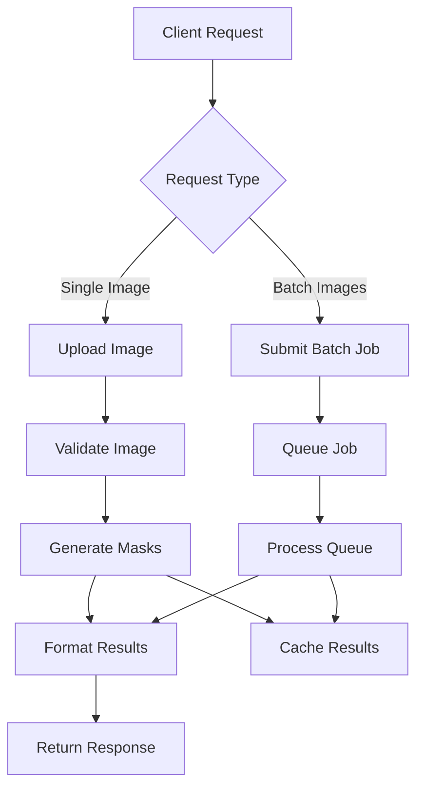

## 1. Product Overview

This project converts an existing Colab notebook that uses Meta's Segment Anything Model (SAM) for automated image segmentation into a production-ready FastAPI service. The API provides scalable image processing capabilities with automatic mask generation, supporting both single image and batch processing workflows.

The service enables developers and data scientists to integrate state-of-the-art computer vision capabilities into their applications without managing complex ML infrastructure. Target users include e-commerce platforms for product image processing, medical imaging applications, and content creation tools requiring automated object detection and segmentation.

## 2. Core Features

### 2.1 User Roles

| Role | Registration Method | Core Permissions |
|------|---------------------|------------------|
| API Consumer | API Key authentication | Access to segmentation endpoints, rate-limited |
| Admin | JWT token authentication | Full API access, model management, system monitoring |

### 2.2 Feature Module

Our SAM segmentation API consists of the following main endpoints:

1. **Health Check**: Service status, model availability, and system metrics
2. **Single Image Segmentation**: Upload image and receive segmentation masks with metadata
3. **Batch Segmentation**: Process multiple images asynchronously with job queue
4. **Model Management**: Model status, version info, and performance metrics
5. **Result Retrieval**: Fetch processed results with visualization options

### 2.3 Page Details

| Page Name | Module Name | Feature description |
|-----------|-------------|---------------------|
| Health Check | Service Status | Returns API health, model loading status, and available compute resources |
| Single Segmentation | Image Upload | Accepts image files (JPEG, PNG, WEBP) with configurable parameters |
| Single Segmentation | Mask Generation | Generates segmentation masks using SAM with configurable thresholds |
| Single Segmentation | Result Format | Returns masks as base64 encoded images plus JSON metadata |
| Batch Segmentation | Job Submission | Accepts multiple images and returns job ID for async processing |
| Batch Segmentation | Job Status | Check processing progress and retrieve results when complete |
| Model Management | Model Info | Display current model version, loading status, and performance metrics |
| Model Management | Model Loading | Automatic model download and caching with error handling |
| Result Retrieval | Visualization | Generate overlay visualizations of masks on original images |
| Result Retrieval | Export Options | Support multiple output formats (PNG, JSON, COCO format) |

## 3. Core Process

### Standard User Flow
1. User uploads image via POST request to `/segment` endpoint
2. API validates image format and size constraints
3. Model processes image and generates segmentation masks
4. Results are formatted with metadata (area, bbox, confidence scores)
5. User receives response with masks and optional visualizations

### Batch Processing Flow
1. User submits multiple images to `/segment/batch` endpoint
2. API returns job ID and estimated processing time
3. User polls `/jobs/{job_id}/status` for progress updates
4. Completed results available at `/jobs/{job_id}/results`
5. Optional webhook notification upon completion

## 4. User Interface Design

### 4.1 Design Style

- **Primary Colors**: Deep blue (#1E40AF) for headers, white (#FFFFFF) for backgrounds
- **Secondary Colors**: Light gray (#F3F4F6) for cards, green (#10B981) for success states
- **Button Style**: Rounded corners (8px radius), hover effects with transition animations
- **Font**: Inter for UI elements, monospace for code examples
- **Layout**: Card-based design with consistent spacing (8px grid system)
- **Icons**: Heroicons for consistency, emoji for status indicators

### 4.2 API Response Design Overview

| Endpoint | Response Type | UI Elements |
|-----------|---------------|-------------|
| Health Check | JSON | Status badges, progress bars for model loading |
| Segmentation | JSON + Base64 | Mask visualization with transparency overlays |
| Batch Status | JSON | Progress bars, estimated time remaining |
| Error Responses | JSON | Clear error messages with suggested actions |

### 4.3 Responsiveness

- **Desktop-first** design approach with mobile optimization
- **Touch interaction** support for mobile devices
- **Responsive breakpoints**: 640px, 768px, 1024px, 1280px
- **Optimized image loading** with progressive enhancement